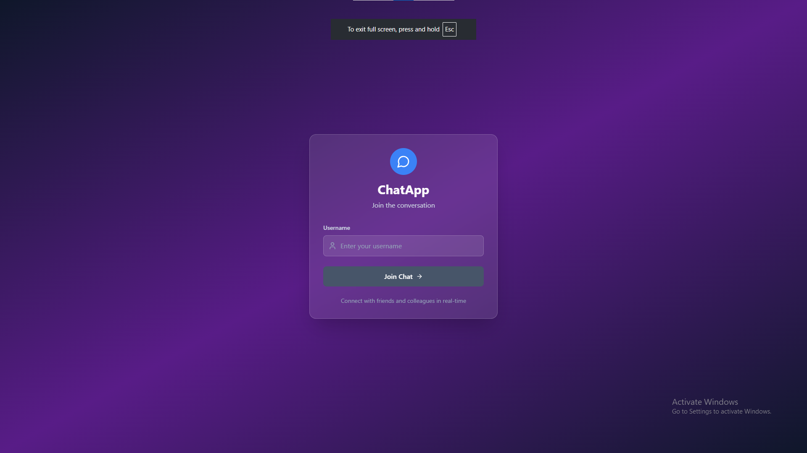
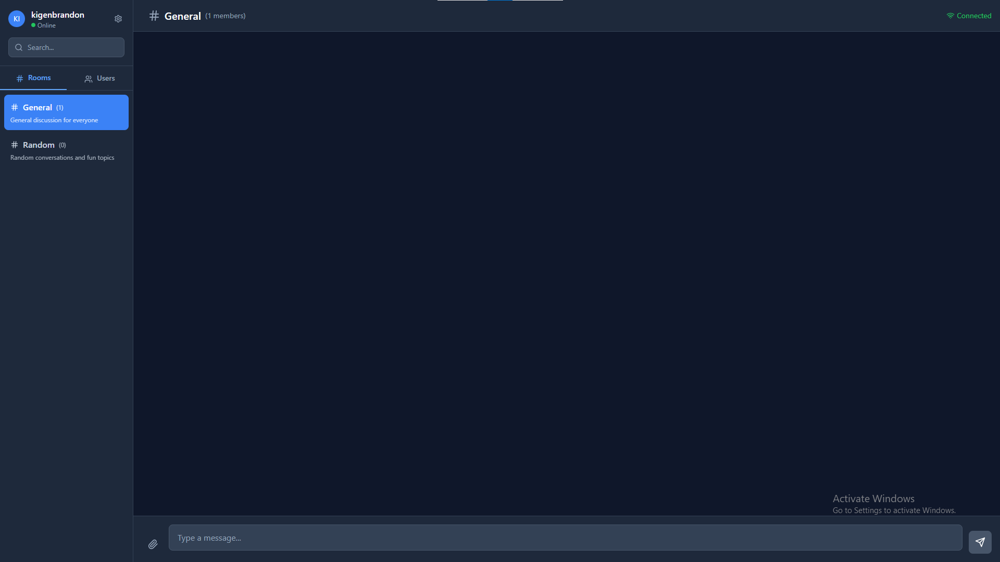

[](https://classroom.github.com/online_ide?assignment_repo_id=19939566&assignment_repo_type=AssignmentRepo)

# 💬 Real-Time Chat Application with Socket.io

This project is a full-stack real-time chat application built with **Socket.io**, **React**, and **Node.js**. It allows users to send and receive messages instantly, join different chat rooms, and see real-time notifications — all powered by bidirectional WebSocket communication.

---

## 📌 Assignment Overview

The objective of this project is to:

* Implement real-time messaging using Socket.io
* Manage user authentication and online presence
* Enable chat room or private messaging functionality
* Provide typing indicators, read receipts, and notifications
* Demonstrate full-stack communication using WebSockets

---

## 🗂️ Project Structure

```
socketio-chat/
├── client/                 # React front-end
│   ├── public/             # Static files
│   ├── src/                # React source code
│   │   ├── components/     # UI components
│   │   ├── context/        # React context providers
│   │   ├── hooks/          # Custom hooks
│   │   ├── pages/          # Chat pages
│   │   ├── socket/         # Socket.io client setup
│   │   └── App.jsx         # Main app component
│   └── package.json        # Client dependencies
├── server/                 # Node.js backend
│   ├── config/             # Server config files
│   ├── controllers/        # Event and chat logic
│   ├── models/             # Data models (e.g. users, messages)
│   ├── socket/             # Socket.io server logic
│   ├── utils/              # Helper functions
│   ├── server.js           # Entry point for the server
│   └── package.json        # Server dependencies
└── README.md               # Project documentation
```

---

## 🚀 Getting Started

### 1. Clone the Repository

```bash
git clone https://github.com/YOUR-USERNAME/YOUR-REPO-NAME.git
cd socketio-chat
```

### 2. Install Dependencies

Run the following commands in both `client/` and `server/` directories:

```bash
npm install
```

### 3. Start the App

#### Start the backend:

```bash
cd server
npm start
```

#### Start the frontend:

```bash
cd client
npm start
```

---

## 📦 Features Implemented

* ✅ Real-time messaging with Socket.io
* ✅ Chat room support
* ✅ User join/leave notifications
* ✅ Typing indicators
* ✅ Read receipts
* ✅ Online presence tracking
* ✅ React context for global state
* ✅ Modular and scalable code structure

---

## 🛠️ Requirements

* Node.js v18+
* npm or yarn
* Chrome or another modern browser
* Basic familiarity with React and Express

---

## 📸 Screenshots / GIFs
* Registration page



* Homepage



---

## 📚 Resources

* [🔗 Socket.io Docs](https://socket.io/docs/v4/)
* [⚛️ React Docs](https://react.dev/)
* [🌐 Express.js Docs](https://expressjs.com/)
* [💡 Chat App Tutorial (Socket.io)](https://socket.io/get-started/chat)

---

## ✅ Submission Checklist

* [x] Core features implemented
* [x] At least 3 advanced features added
* [x] App runs without errors
* [x] Documentation completed
* [x] Screenshots or demo included
* [x] Code pushed to GitHub Classroom

---

Feel free to customize or expand this README based on your implementation, additional features, or deployment details.
